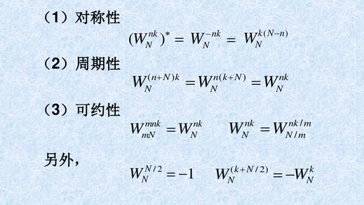
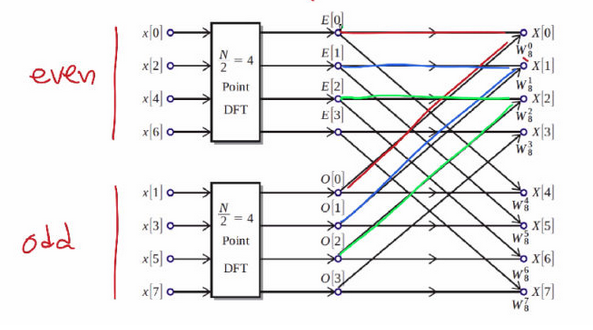
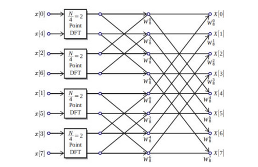
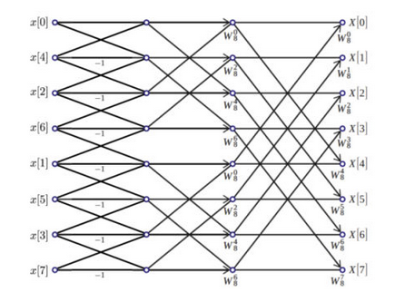
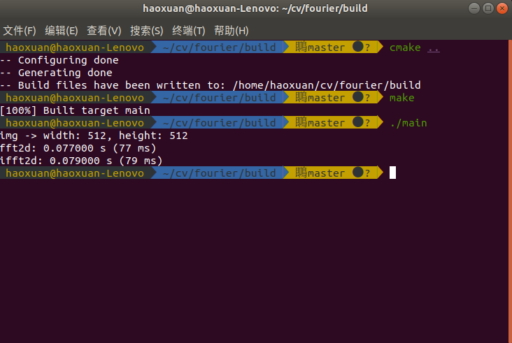
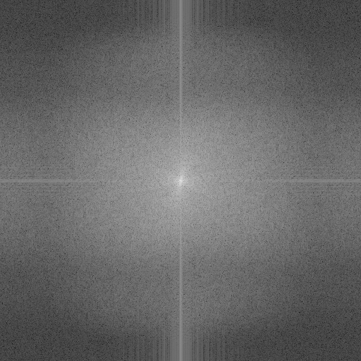

# Fast-Fourier-Transform

- Date: 2019/12/08
- Version: 1.0.0

## 实现过程

网上资料太烂, 根本不用看, 对照蝶形图自己敲就行  
  
  
  
  

## 运行效率

- 测试数据为[src/49.png](src/49.png), 图片预处理后为512 x 512大小, **单通道灰度图**, FFT大约为0.073 s = 73 ms  
  
  
  

## How to run
```shell
mkdir build
cd build
cmake ..
make
./main
```

## 待补充

- IFFT
- 封装接口(Complete)
