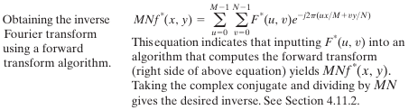
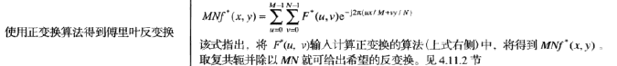
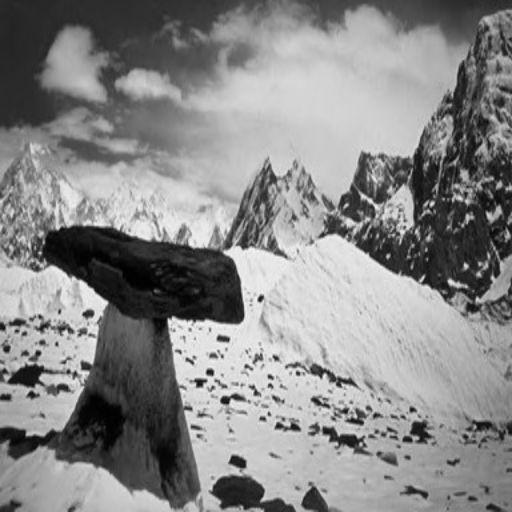

# Fast-Fourier-Transform

- Date: 2019/12/17
- Version: 1.0.0

## Description

FFT2d && IFFT2d

## Details

- **FFT**  
  
  
  
  

- **IFFT**  
  



## Run time

- test file: [src/49.png](src/49.png), to perform FFT & IFFT, it resize(512 x 512), **one channel, grey image** 
  
  
  


## How to run
```shell
mkdir build
cd build
cmake ..
make
./main
```
