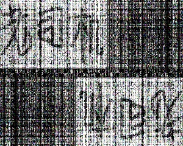

# Fast-Fourier-Transform & Watermarks

- Date: 2019/12/17
- Version: 0.9.0

## Description

- 参考知乎[阿里巴巴公司根据截图查到泄露信息的具体员工的技术是什么？](https://www.zhihu.com/question/50735753/answer/122593277)最高赞@fuqiang liu 的回答, 依赖opencv(只调用了imread与操作图片像素的接口)实现了**FFT2d, IFFT2d, encode, decode**.   

- 加解密的效果  
    - TEST1 (原图300 x 240)  

    | 原图| 水印| 加水印| 直接解密| 经jpg压缩后再次读取图片解密|
    |:-:|:-:|:-:|:-:|:-:|
    | | | | | |
    
    - TEST2 (原图4000 x 2250)  

    | 原图| 水印| 加水印| 直接解密| 经jpg压缩后再次读取图片解密|
    |:-:|:-:|:-:|:-:|:-:|
    | | | | | |

    - TEST3 (原图4000 x 2250)

    | 原图| 水印| 加水印| 直接解密| 经jpg压缩后再次读取图片解密|
    |:-:|:-:|:-:|:-:|:-:|
    | | | | | |

- 上述测试中TEST2与TEST3的经jpg压缩后再次读取图片解密效果不太好, 可能原因有: 原图太大, 水印不够简单, 比如TEST2中水印为一个火箭.  

- Bug: 在测试[test_img/bug1.jpg](test_img/bug1.jpg)过程中(750 x 1334), 让其作为原图, 发现内存爆了...目前尚不清楚原因, 但是4K的图都能成功处理, 有点奇怪, 此Bug尚待解决.

- DIR
```
.
├── CMakeLists.txt
├── include
│   ├── common.h
│   ├── decode.h
│   ├── encode.h
│   ├── fft2d.h
│   ├── fft.h
│   └── ifft2d.h
├── README.md
├── res
│   ├── processed_test1.jpg
│   ├── processed_test2.jpg
│   ├── processed_test3.jpg
│   ├── res1_compress.jpg
│   ├── res1.jpg
│   ├── res2_compress.jpg
│   ├── res2.jpg
│   ├── res3_compress.jpg
│   └── res3.jpg
├── src
│   ├── common.cpp
│   ├── decode.cpp
│   ├── encode.cpp
│   ├── fft2d.cpp
│   ├── fft.cpp
│   ├── ifft2d.cpp
│   └── main.cpp
└── test_img
    ├── bug1.jpg
    ├── test1.jpg
    ├── test2.jpg
    ├── water1.jpg
    └── water2.jpg
```

## Interface

- FFT
```CPP
#include "fft2d.h"

Mat img = imread(...);
fftPair fft = fftPair(img);
Mat fft_img = fft2d(&fft);
imshow("fft", fft_img);
waitKey();
```

- IFFT
```cpp
#include "fft2d.h"
#include "ifft2d.h"

Mat img = imread(TEST_IMG);
fftPair fft = fftPair(img);
Mat fft_img = fft2d(&fft);
Mat ifft_img = ifft2d(&fft);
imshow("ifft", ifft_img);
waitKey();
```

- encode
```cpp
#include "encode.h"

Mat img = imread(TEST_IMG);
Mat water_img = imread(WATER_IMG);
Mat processed_img = encode(img, water_img);
imshow("encode", processed_img);
waitKey();
```

- decode
```cpp
#include "decode.h"

Mat img = imread(TEST_IMG);
Mat water_img = imread(WATER_IMG);
Mat processed_img = encode(img, water_img); // or processed_img = imread(".jpg or .png");
Mat res_img = decode(processed_img, img);
imshow("decode", res_img);
waitKey();
```

## How to run
```shell
mkdir build
cd build
cmake ..
make
./main
```

## Run time

- FFT & IFFT
    - 512 x 512 (三通道): 0.1 s
    - 4096 x 4096 (三通道): 17s

